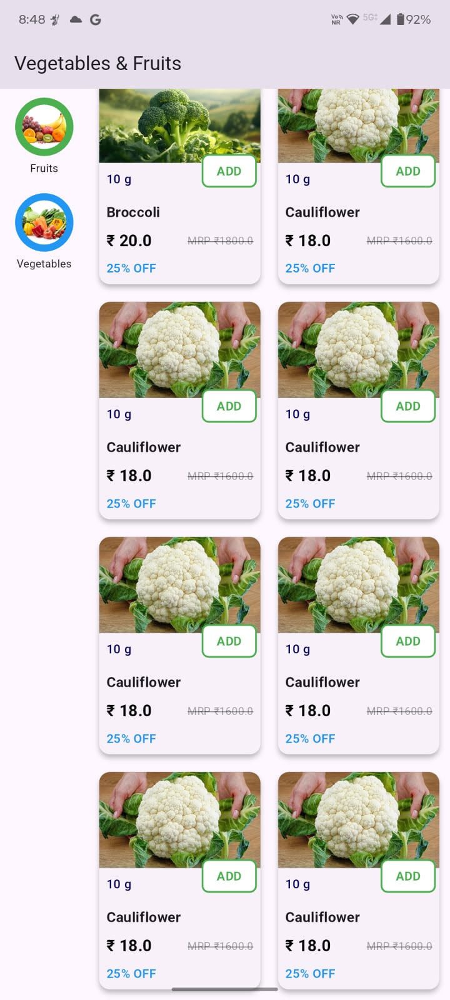
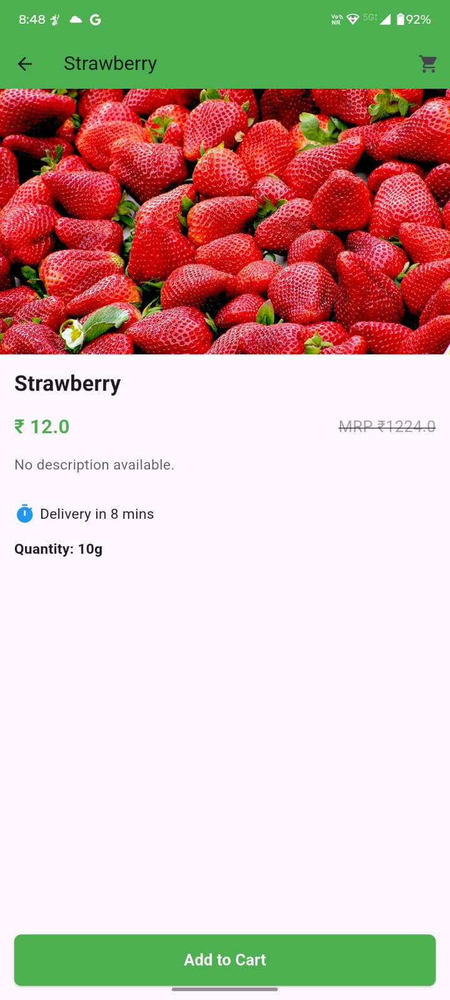

<!DOCTYPE html>
<html lang="en">
<head>
    <meta charset="UTF-8">
    <meta name="viewport" content="width=device-width, initial-scale=1.0">
    <title>GreenBasket - Flutter App</title>
</head>
<body>
    <h2>Overview</h2>
    
GreenBasket is a Flutter application that allows users to browse products by categories and load paginated product lists dynamically. It is built using Flutter and follows the BLoC architecture for state management.

    <h2>Features</h2>
    <ul>
        <li><strong>Category Selection:</strong> Users can browse products based on categories.</li>
        <li><strong>Product Listing:</strong> Products are displayed dynamically based on selected categories.</li>
        <li><strong>Pagination:</strong> Implements infinite scrolling to load more products.</li>
        <li><strong>API Integration:</strong> Fetches data using Dio from the given endpoint.</li>
        <li><strong>State Management:</strong> Uses BLoC to manage category and product states efficiently.</li>
    </ul>

    <h2>Project Structure</h2>
   
    <h2>Installation</h2>
    <ol>
        <li>Clone the Repository:</li>
        <pre>git clone https://github.com/yourusername/greenbasket.git</pre>
        <li>Navigate to the project directory:</li>
        <pre>cd greenbasket</pre>
        <li>Install dependencies:</li>
        <pre>flutter pub get</pre>
        <li>Run the app:</li>
        <pre>flutter run</pre>
    </ol>

    <h2>API Integration</h2>
    
<strong>Base URL:</strong> <code>https://alpha.bytesdelivery.com/api/v3</code>

    
<strong>Product API Endpoint:</strong>

    <pre>GET /product/category-products/:value/:category_id/:page</pre>
    
Handles cases where <code>category_id</code> is <code>null</code> for initial product fetching.

    <h2>Dependencies</h2>
    <ul>
        <li><code>flutter_bloc: ^8.1.3</code></li>
        <li><code>dio: ^5.0.0</code></li>
        <li><code>equatable: ^2.0.5</code></li>
    </ul>

    <h2>Usage</h2>
    <ol>
        <li>Select a category from the category slider.</li>
        <li>The product list updates dynamically based on the selected category.</li>
        <li>Scroll down to load more products automatically.</li>
    </ol>

    <h2>Download</h2>
    
<strong>APK File</strong> <a href="#">Download Here</a>

    <h2>Screenshots</h2>
    
<strong>Home Page:</strong>

    

    
<strong>Category Selection:</strong>

    

    <h2>Contributions</h2>
    
Contributions are welcome! Feel free to fork the repo and submit a pull request.

    <h2>License</h2>
    
This project is open-source and available under the MIT License.

</body>
</html>
